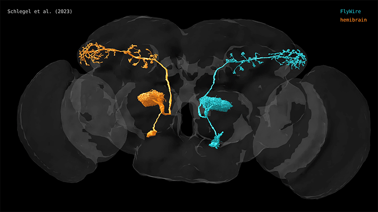
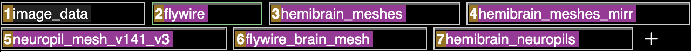
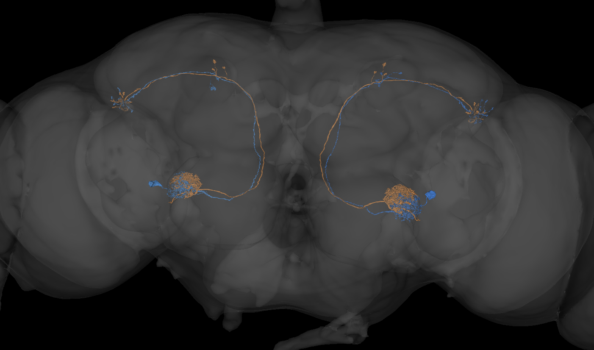
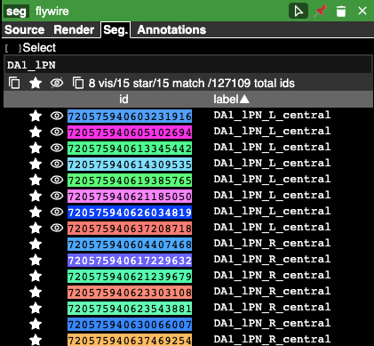
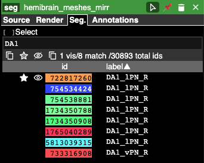

# cocoglancer [{width="256"}](https://tinyurl.com/flywirehb)

**cocoglancer** is a simple web application designed to allow co-visualisation of multiple connectomics datasets. It's almost a cheat to call it an application of its own: it is just the mainline version of [neuroglancer](https://github.com/google/neuroglancer) preloaded with a specific set of layers hosted by the [itanna](https://www.itanna.io/index.html) collaborative project (D. Bock and G. Jefferis) and the [MRC LMB in Cambridge](https://www2.mrc-lmb.cam.ac.uk/). However, despite this simplicity we have found it incredibly useful for comparing fly connectome data and we expect many others will find the same.

The key features are 1) that it allows co-visualisation of FlyWire and hemibrain neurons in the same space with 2) enables live querying of cell type / class annotations within the same viewer.

## Data Layers

The basic scene is accessible from the url <https://tinyurl.com/flywirehb>. This includes seven layers:

1.  EM image data

2.  FlyWire segmentation, specifically the version 630 flywire static meshes. These are faster to load than the dynamic meshes used in the production version of flywire and available for anyone to view without authentication.

3.  hemibrain meshes mapped into FAFB-flywire space (prepared by PS and SJ, see Schlegel et al methods for details)

4.  hemibrain meshes mapped onto the opposite side of FAFB-flywire space. Use this to compare neurons on the right hand side of FAFB with the hemibrain (prepared by EP and PS, see Schlegel et al methods for details of mirroring transforms).

5.  neuropil meshes for flywire (prepared by PS and GJ, see Dorkenwald et al methods for details).

6.  An accurate neuropil mesh for the whole FAFB brain prepared from FlyWire synapse data by PS.

7.  A neuropil mesh for the whole hemibrain volume mapped into FAFB-FlyWire space.

For us the key benefit of this setup is being able to directly co-visualise neurons from FlyWire and the hemibrain in order to draw conclusions about cell types. Early on we also found it useful for reviewing FlyWire neurons e.g. to see when neurons might have false merges or splits. Neuroglancer layers can be

## Annotations

Besides the data layers listed above that bring FlyWire and hemibrain data into the same space, the other killer feature of **cocoglancer** is querying neuron annotations directly from within neuroglancer. Go to the layer information tab and type any regular expression query into the text box.

{width="281"} {width="228"}

## Acknowledgements

As explained above, **cocoglancer** is just a specific configuration of neuroglancer developed by the amazing [Jeremy Maitin-Shepard](https://github.com/jbms) from the Google Brain team. Much kudos to him! Co-author Eric Perlman runs the itanna.io servers currently hosting much of the data. Data at the MRC LMB is hosted with the assistance of the MRC LMB Scientific Computing team. This project was supported by the Wellcome Trust, the MRC and the BRAIN initiative through NIH and NSF Neuronex2 project.

If you find **cocoglancer** useful in your work, please cite Schlegel et al 2023 as described on the front page.
